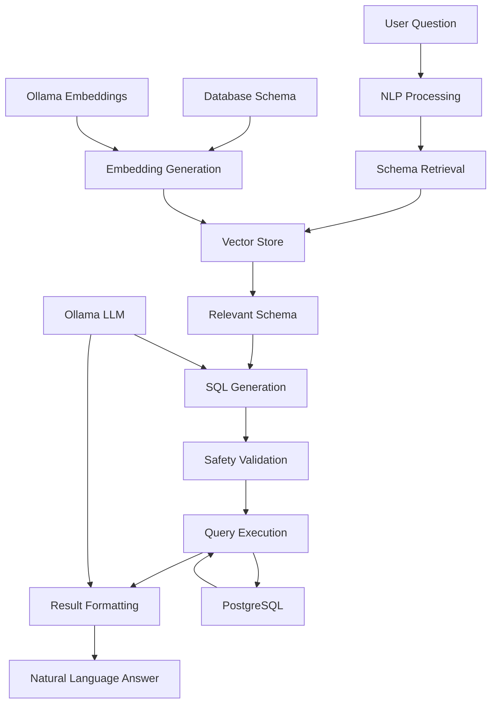

# Chat with SQL - RAG-Based Natural Language to SQL System

[](https://python.org)
[](https://fastapi.tiangolo.com)
[](https://postgresql.org)
[](https://ollama.ai)

A production-style prototype that converts natural language questions into safe SQL queries using Retrieval-Augmented Generation (RAG) with **Ollama** for local LLM processing.

## 🎯 Overview

This system enables users to ask questions in natural language and get answers from their database without writing SQL queries directly. It uses advanced RAG techniques to understand database schema, generate safe SQL queries, and provide natural language responses.

## 🏗️ System Architecture



### Core Components

1. **API Layer** (`src/chat_sql/api/`)
   - FastAPI REST endpoints
   - Request/response models
   - Health checks and monitoring

2. **Core Pipeline** (`src/chat_sql/core/`)
   - Main orchestration logic
   - Pipeline coordination
   - Error handling

3. **Database Layer** (`src/chat_sql/db/`)
   - Connection management
   - Schema extraction and loading
   - Query execution

4. **RAG System** (`src/chat_sql/rag/`)
   - Text embedding using Ollama
   - Vector store with FAISS
   - Schema retrieval

5. **LLM Integration** (`src/chat_sql/llm/`)
   - SQL generation using Ollama
   - Result formatting
   - Natural language responses

6. **Safety Layer** (`src/chat_sql/safety/`)
   - SQL validation
   - Security checks
   - Injection prevention

## 📁 Project Structure

```
talk_to_db/
├── src/
│   └── chat_sql/
│       ├── __init__.py
│       ├── config.py
│       ├── chat_cli.py
│       ├── setup_database.py
│       ├── setup_ollama.py
│       ├── requirements.txt
│       ├── .env.example
│       │
│       ├── api/
│       │   ├── __init__.py
│       │   └── app.py                 # FastAPI application
│       │
│       ├── core/
│       │   ├── __init__.py
│       │   └── chat_with_sql.py       # Main pipeline
│       │
│       ├── db/
│       │   ├── __init__.py
│       │   ├── connection.py          # Database connection
│       │   └── schema_loader.py       # Schema extraction
│       │
│       ├── rag/
│       │   ├── __init__.py
│       │   ├── embedder.py            # Text embedding
│       │   ├── vector_store.py        # FAISS vector store
│       │   └── retriever.py           # Schema retrieval
│       │
│       ├── llm/
│       │   ├── __init__.py
│       │   ├── sql_generator.py       # SQL generation
│       │   └── result_formatter.py    # Result formatting
│       │
│       └── safety/
│           ├── __init__.py
│           └── sql_validator.py       # SQL validation
│
├── docs/
│   ├── architecture/
│   │   ├── system-design.md
│   │   ├── database-design.md
│   │   └── workflow.md
│   ├── api/
│   │   └── openapi.json
│   └── development/
│       ├── setup-guide.md
│       ├── testing.md
│       └── contributing.md
│
├── tests/
│   ├── unit/
│   └── integration/
│
├── scripts/
│   ├── setup.sh
│   └── deploy.sh
│
├── config/
│   ├── docker-compose.yml
│   └── nginx.conf
│
├── docker/
│   ├── Dockerfile
│   └── docker-compose.prod.yml
│
└── README.md
```

## 🚀 Quick Start

### Prerequisites

- Python 3.8+
- PostgreSQL 12+
- **Ollama** installed and running

### 1. Install Dependencies

```bash
# Navigate to project directory
cd talk_to_db

# Create virtual environment
python -m venv venv
source venv/bin/activate  # On Windows: venv\Scripts\activate

# Install dependencies
pip install -r src/chat_sql/requirements.txt
```

### 2. Setup Environment

```bash
# Copy environment template
cp src/chat_sql/.env.example src/chat_sql/.env
# Edit .env with your configuration
```

### 3. Install and Start Ollama

```bash
# Install Ollama (if not already installed)
# macOS: brew install ollama
# Linux: curl -fsSL https://ollama.ai/install.sh | sh
# Windows: Download from https://ollama.ai/download

# Start Ollama service
ollama serve

# Setup required models
python src/chat_sql/setup_ollama.py
```

### 4. Setup Database

```bash
# Run database setup script
python src/chat_sql/setup_database.py
```

### 5. Start the API Server

```bash
# Navigate to source directory
cd src/chat_sql

# Start FastAPI server
python api/app.py

# Or use uvicorn directly
uvicorn api.app:app --host 0.0.0.0 --port 8000 --reload
```

The API will be available at `http://localhost:8000`

## 📊 Database Design

### Sample Schema

The system uses a project management database as an example:

```sql
-- Users table
CREATE TABLE users (
    id SERIAL PRIMARY KEY,
    name VARCHAR(100) NOT NULL,
    email VARCHAR(100) UNIQUE NOT NULL,
    created_at TIMESTAMP DEFAULT CURRENT_TIMESTAMP
);

-- Projects table
CREATE TABLE projects (
    id SERIAL PRIMARY KEY,
    name VARCHAR(100) NOT NULL,
    description TEXT,
    created_at TIMESTAMP DEFAULT CURRENT_TIMESTAMP
);

-- Tasks table
CREATE TABLE tasks (
    id SERIAL PRIMARY KEY,
    title VARCHAR(200) NOT NULL,
    status VARCHAR(50) DEFAULT 'pending',
    assigned_to INTEGER REFERENCES users(id),
    project_id INTEGER REFERENCES projects(id),
    created_at TIMESTAMP DEFAULT CURRENT_TIMESTAMP,
    due_date DATE
);
```

### Schema Extraction

The system automatically extracts:
- Table names and descriptions
- Column names, types, and constraints
- Foreign key relationships
- Index information
- Sample data patterns

## 🔌 API Reference

### Chat Endpoint

```http
POST /chat
Content-Type: application/json

{
  "question": "Which users have more than 3 tasks?"
}
```

**Response:**
```json
{
  "answer": "Aditya has 5 tasks. Rohit has 4 tasks.",
  "sql": "SELECT u.name, COUNT(t.id) as task_count FROM users u LEFT JOIN tasks t ON u.id = t.assigned_to GROUP BY u.id, u.name HAVING COUNT(t.id) > 3 LIMIT 200",
  "explanation": "This query counts tasks per user and filters for those with more than 3 tasks",
  "results": [
    {"name": "Aditya", "task_count": 5},
    {"name": "Rohit", "task_count": 4}
  ],
  "warnings": [],
  "error": null,
  "metadata": {
    "result_count": 2,
    "schema_retrieved": true,
    "sql_validated": true
  }
}
```

### Other Endpoints

- `GET /health` - System health check
- `GET /schema/stats` - Schema statistics
- `POST /schema/refresh` - Refresh schema cache
- `GET /config` - Current configuration
- `GET /docs` - Interactive API documentation

## 🔒 Security Features

### SQL Validation

- **SELECT-only queries**: Rejects INSERT, UPDATE, DELETE, DROP, etc.
- **Pattern detection**: Blocks dangerous SQL patterns
- **System table protection**: Prevents access to system tables
- **Injection detection**: Identifies potential SQL injection attempts
- **Result limiting**: Automatically adds LIMIT clause (default: 200 rows)

### Safety Examples

```sql
-- ✅ ALLOWED: Simple SELECT
SELECT * FROM users WHERE name = 'John';

-- ❌ REJECTED: Not a SELECT query
UPDATE users SET name = 'hacked' WHERE id = 1;

-- ❌ REJECTED: Multiple statements
SELECT * FROM users; DROP TABLE users;

-- ❌ REJECTED: System table access
SELECT * FROM pg_user;

-- ❌ REJECTED: SQL injection pattern
SELECT * FROM users WHERE name = 'admin' OR 1=1;
```

## 🧪 Example Queries

Try these sample questions:

```bash
# Basic queries
curl -X POST "http://localhost:8000/chat" \
  -H "Content-Type: application/json" \
  -d '{"question": "Show all users"}'

# Aggregation queries
curl -X POST "http://localhost:8000/chat" \
  -H "Content-Type: application/json" \
  -d '{"question": "How many tasks does each user have?"}'

# JOIN queries
curl -X POST "http://localhost:8000/chat" \
  -H "Content-Type: application/json" \
  -d '{"question": "What are the tasks assigned to Aditya?"}'

# Complex queries
curl -X POST "http://localhost:8000/chat" \
  -H "Content-Type: application/json" \
  -d '{"question": "Which projects have the most pending tasks?"}'
```

## ⚙️ Configuration

### Environment Variables

| Variable | Default | Description |
|----------|---------|-------------|
| `OLLAMA_BASE_URL` | `http://localhost:11434` | Ollama server URL |
| `OLLAMA_LLM_MODEL` | `llama3.2` | Model for SQL generation |
| `OLLAMA_EMBED_MODEL` | `nomic-embed-text` | Model for embeddings |
| `POSTGRES_HOST` | `localhost` | PostgreSQL host |
| `POSTGRES_DB` | `chatdb` | Database name |
| `TOP_K_RETRIEVAL` | `5` | Schema documents to retrieve |
| `MAX_ROWS` | `200` | Maximum rows per query |
| `SQL_TIMEOUT_SECONDS` | `30` | SQL query timeout |

## 🛠️ Development

### For New Developers

Welcome to the team! This guide will help you get started:

#### 1. Understanding the Codebase

- **Start with the README** - You're already here!
- **Read the Architecture Guide** - `docs/architecture/system-design.md`
- **Review the Database Design** - `docs/architecture/database-design.md`
- **Understand the Workflow** - `docs/architecture/workflow.md`

#### 2. Setup Your Development Environment

Follow the Quick Start guide above, then:

```bash
# Install development dependencies
pip install pytest pytest-asyncio black flake8 mypy

# Run tests
pytest tests/

# Code formatting
black src/
flake8 src/
```

#### 3. Key Components to Understand

1. **Pipeline (`core/chat_with_sql.py`)** - Main orchestration
2. **Schema Retrieval (`rag/`)** - How we find relevant schema
3. **SQL Generation (`llm/sql_generator.py`)** - How we create SQL
4. **Safety (`safety/sql_validator.py`)** - How we keep queries safe

#### 4. Common Tasks

- **Adding a new table**: Update database, refresh schema
- **Modifying safety rules**: Edit `safety/sql_validator.py`
- **Changing LLM models**: Update `.env` and run setup
- **Adding API endpoints**: Modify `api/app.py`

### Testing

```bash
# Run all tests
pytest

# Run unit tests only
pytest tests/unit/

# Run integration tests only
pytest tests/integration/

# Run with coverage
pytest --cov=src/
```

### Contributing

1. Fork the repository at https://github.com/adityatiwari12/TalkwithDB
2. Create a feature branch
3. Make your changes
4. Add tests if applicable test suite
6. Submit a pull request

## 🔧 Troubleshooting

### Common Issues

1. **Ollama Connection Failed**
   ```bash
   # Check if Ollama is running
   ollama list
   
   # Start Ollama
   ollama serve
   ```

2. **Model Not Found**
   ```bash
   # Setup models
   python src/chat_sql/setup_ollama.py
   
   # Check installed models
   ollama list
   ```

3. **Database Connection Failed**
   ```bash
   # Check PostgreSQL status
   pg_isready
   
   # Setup database
   python src/chat_sql/setup_database.py
   ```

4. **SQL Generation Errors**
   ```bash
   # Check schema stats
   curl http://localhost:8000/schema/stats
   
   # Refresh schema
   curl -X POST http://localhost:8000/schema/refresh
   ```

## 📈 Performance

- **Embedding Cache**: Schema embeddings cached in FAISS
- **Connection Pooling**: Efficient database connection management
- **Result Limiting**: Automatic LIMIT prevents large result sets
- **Local Processing**: Fast local inference with Ollama

## 🐳 Docker Deployment

```bash
# Build and run with Docker Compose
docker-compose up -d

# View logs
docker-compose logs -f

# Stop services
docker-compose down
```

## 📝 License

This project is for educational and demonstration purposes.

## 🤝 Support

- Check the troubleshooting section
- Review the API documentation at `http://localhost:8000/docs`
- Examine logs for detailed error messages
- Read the development guides in `docs/development/`

---

**Built with ❤️ for the developer community**
