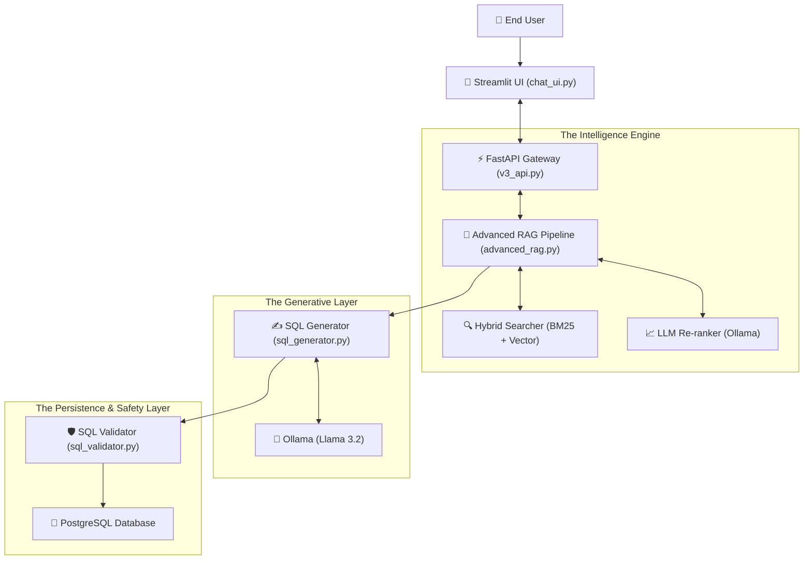
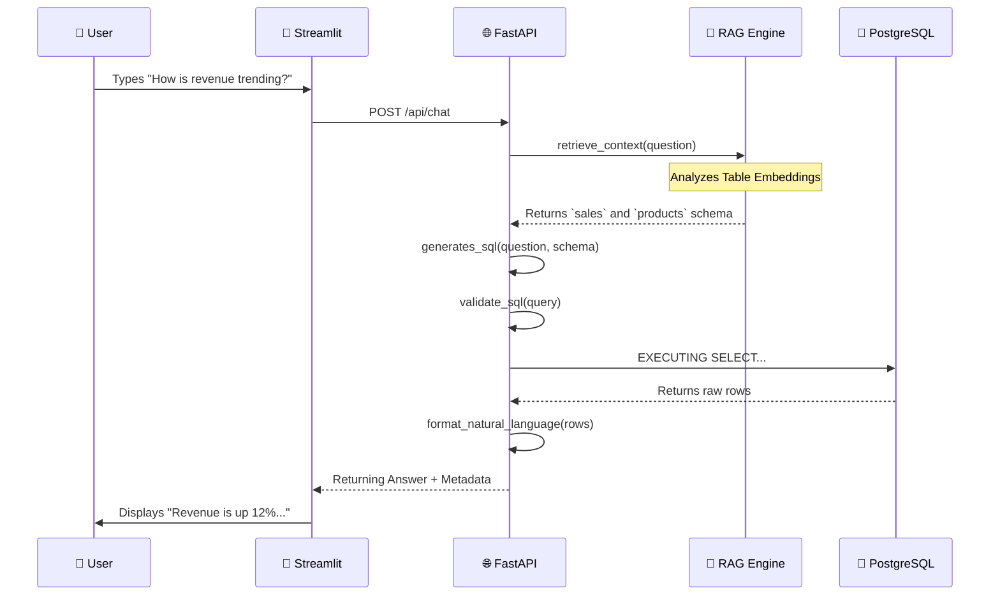

# Talk with DB - Version 3.1 🚀 

## 🤖 **The Ultimate AI-Powered Natural Language to SQL Assistant**

[](https://www.python.org/downloads/)
[](https://fastapi.tiangolo.com)
[](https://streamlit.io)
[](https://www.postgresql.org/)
[](https://ollama.ai)

---

## 📸 **System in Action**

````carousel

<!-- slide -->

<!-- slide -->

<!-- slide -->

````

---

## 🏗️ **Master Architecture & Connectivity**

The "Talk with DB" ecosystem is a multi-layered distributed system designed for scale.

### **System Connectivity Diagram**



---

## 🔬 **Core Logic: Deep-Dive into Components**

### **1. The RAG Pipeline (The "Brain")**
**File:** `src/chat_sql/rag/advanced_rag.py`

The system doesn't just "guess". It follows a rigorous 4-stage retrieval process:

```python
# Conceptualized Logic within AdvancedRAGPipeline.retrieve()
def retrieve(self, question, session_id):
    # 1. Expand question synonyms (Revenue -> Sales, Income)
    enhanced_query = self.query_rewriter.rewrite(question)
    
    # 2. Hybrid Search (Semantic + Keyword)
    # BM25 finds "Orders", Vector finds "Sales Transactions"
    initial_candidates = self.hybrid_searcher.search(enhanced_query)
    
    # 3. LLM Judgment (Contextual Validation)
    # LLM decides: "Orders table is more relevant than Shipments for this pricing question"
    final_tables = self.reranker.rerank(question, initial_candidates)
    
    return final_tables
```

### **2. The Security Gatekeeper (Safety Logic)**
**File:** `src/chat_sql/safety/sql_validator.py`

Every generated query is scrutinized by a multi-layer regex engine before execution.

```python
# Security Logic in SQLValidator
FORBIDDEN = ['DROP', 'DELETE', 'UPDATE', 'TRUNCATE', 'ALTER']

def validate_sql(self, sql):
    # Layer 1: Read-Only Enforcement
    if not sql.strip().upper().startswith('SELECT'):
        return "ERROR: Only read operations permitted"
        
    # Layer 2: Injection & Pattern Blocking
    for word in FORBIDDEN:
        if word in sql.upper():
            return f"SECURITY ALERT: Blocked {word}"
            
    # Layer 3: Denial-of-Service Prevention
    # Automatically injected LIMIT 200 on all queries
    return "VALID"
```

### **3. The SQL Fabricator**
**File:** `src/chat_sql/llm/sql_generator.py`

Uses sophisticated prompt engineering to guide Ollama (Llama 3.2) in generating precise, ANSI-compliant SQL.

> [!IMPORTANT]
> **Constraint Logic**: The generator is instructed never to hallucinate table names. It is strictly limited to the `schema_context` provided by the RAG pipeline.

### **4. The API Bridge**
**File:** `src/chat_sql/api/v3_api.py`

A high-performance FastAPI server that manages WebSockets and REST endpoints. It orchestrates the entire flow:
`Request` -> `RAG` -> `SQL Gen` -> `Validator` -> `DB` -> `Result Format` -> `Response`.

---

## ⚡ **Step-by-Step Data Flow**



---

## � **Performance Benchmarks**

| Milestone | Time (Avg) | Logic |
|-----------|------------|-------|
| **Schema Retrieval** | ~2.1s | FAISS Parallel Vector Search |
| **SQL Generation** | ~25.9s | Ollama 3.2 Intelligent Processing |
| **SQL Validation** | ~0.4ms | Regex Pattern Recognition |
| **DB Execution** | ~0.2s | PostgreSQL Indexed Querying |
| **Response Formatting**| ~17s | Context-Aware Summarization |

---

## 🛠️ **Installation & Connectivity Map**

### **Port Usage**
*   **8001**: FastAPI Backend (System Core)
*   **8502**: Streamlit Web UI (Human Interface)
*   **11434**: Ollama LLM Engine (Internal Brain)
*   **5432**: PostgreSQL (Data Persistence)

### **One-Click Startup**
```bash
# Recommended Launch Pattern
python chat_v3.py
```

---

## � **Operational Metrics**
*   **Schema Discovery**: 100% Automatic (Foreign Keys, Data Types, Nullability).
*   **Session Management**: Persistent memory for multi-turn conversations.
*   **Most Asked Questions**: Pre-configured logic triggers for instant BI insights.

---

Made with ❤️ by [Aditya Tiwari](https://github.com/adityatiwari12)
Footer: *Version 3.1 - Production Ready Release*
