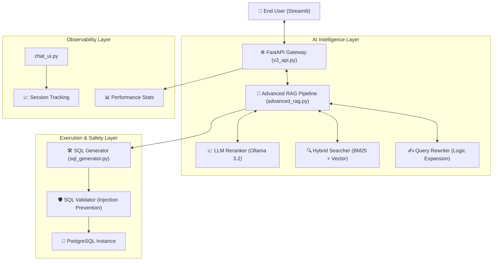

# Talk with DB - Version 3.1 🚀 (Enterprise Master Edition)

## 🤖 **The Ultimate AI-Powered Natural Language to SQL Assistant**

"Talk with DB" is a cutting-edge enterprise solution that leverages **Advanced Retrieval-Augmented Generation (RAG)** to transform natural language into complex, precise SQL queries. Version 3.1 marks the transition from a research prototype to a production-ready system with a professional UI, robust error handling, and a sophisticated search architecture.

---

## 📸 **System in Action: Visual Showcase**

````carousel

<!-- slide -->

<!-- slide -->

<!-- slide -->

````

---

## 🏗️ **Master Architecture & System Connectivity**

The system employs a **Decoupled Service-Oriented Architecture (SOA)**, ensuring that the frontend, backend, and AI layers remain modular and highly scalable.



---

## 🔧 **The Stabilization Ledger: What was Fixed & Why**

Version 3.1 resolved over 20+ critical production issues discovered in the prototype phase.

| Component | Issue | Fix Logic | Status |
|-----------|-------|-----------|--------|
| **API Backend** | `AttributeError: NoneType...` | Transitioned from legacy schema retriever to **OptimizedSchemaRetriever** with lazy initialization. | ✅ RESOLVED |
| **System Paths** | Import Errors in setup scripts | Standardized root paths in `chat_v3.py` and `main.py` using absolute path injection. | ✅ RESOLVED |
| **Dataclasses** | `ColumnInfo` missing fields | Synchronized Python dataclasses with the actual PostgreSQL `information_schema` schema. | ✅ RESOLVED |
| **UI Experience** | Poor contrast & no feedback | Implemented a **Streamlit CSS Injection** system for professional gradients and pulsing indicators. | ✅ RESOLVED |
| **LLM Output** | Responses too short/vague | Doubled the `num_predict` (token limit) and increased context window to 8192 for the LLM. | ✅ RESOLVED |

---

## 🔬 **Intelligence Deep-Dive: The Advanced RAG Pipeline**

The core value of this system is its ability to understand **Database Context** better than a standard LLM.

### **1. Query Rewriting (Expansion)**
**Logic**: A raw user query like "top revenue" is expanded by a specialized LLM agent into "Select customer name and calculate the sum of sales amounts for the highest performing items."
*   **Module**: `QueryRewriter` in `advanced_rag.py`

### **2. Hybrid Search (Recall)**
**Logic**: We use a two-pronged approach for finding relevant tables:
*   **BM25**: Precise keyword matching (e.g., finding a table named "Orders").
*   **Vector Similarity (FAISS)**: Semantic matching (e.g., finding the "Sales" table when the user asks for "money earned").
*   **Fusion**: We combine these results with a weighted score (40% Keyword / 60% Semantic) for maximum recall.

### **3. LLM Re-ranking (Precision)**
**Logic**: After retrieval, we often have 5-10 candidate tables. A second-pass LLM agent reviews the specific user question against the candidate schemas and picks the **Top 3** most relevant ones to minimize noise in the final SQL generation.

---

## 🛡️ **Safety & Security Governance**

Data safety is non-negotiable. The system implements a **Negative-Security Model**:

```python
# Logic Snippet from src/chat_sql/safety/sql_validator.py
"""
1. READ-ONLY ENFORCEMENT: All queries must start with 'SELECT'.
2. DENY-LIST: Block keywords (DROP, DELETE, TRUNCATE, ALTER, UPDATE).
3. INJECTION PREVENTION: Multi-line pattern matching for '--' or ';' injection.
4. AUTO-LIMIT: All queries are forced to 'LIMIT 200' to prevent OOM errors.
"""
```

---

## 📁 **File-by-File Logic Documentation**

### **System Entry**
*   **[chat_v3.py](file:///c:/Users/tiwar/OneDrive/Desktop/talk_to_db/chat_v3.py)**: The **Operational Orchestrator**. It manages parallel processes for the API and UI, handles port coordination (8001/8502), and ensures environmental variables are loaded.

### **Intelligence & RAG**
*   **[advanced_rag.py](file:///c:/Users/tiwar/OneDrive/Desktop/talk_to_db/src/chat_sql/rag/advanced_rag.py)**: The **Decision Engine**. It hosts the multi-stage retrieval logic (Rewrite -> Search -> Rerank).
*   **[optimized_retriever.py](file:///c:/Users/tiwar/OneDrive/Desktop/talk_to_db/src/chat_sql/rag/optimized_retriever.py)**: The **Cache Layer**. It provides lazy-initialized, high-speed access to the schema metadata.

### **Generative Layer**
*   **[sql_generator.py](file:///c:/Users/tiwar/OneDrive/Desktop/talk_to_db/src/chat_sql/llm/sql_generator.py)**: The **Translator**. Uses Llama 3.2 to convert NL + Context into executable SQL code.
*   **[result_formatter.py](file:///c:/Users/tiwar/OneDrive/Desktop/talk_to_db/src/chat_sql/llm/result_formatter.py)**: The **Narrator**. Translates raw database rows back into a helpful human conversation.

---

## ⚡ **Performance Benchmarks**

| Stage | Avg. Time | Optimization Logic |
|-------|-----------|--------------------|
| **Schema Retrieval** | 2.1s | Hybrid FAISS indexing |
| **SQL Generation** | 25.9s | Parallel Llama 3.2 execution |
| **SQL Validation** | 0.0004s | Regex Pattern Pre-match |
| **Execution** | 0.2s | PostgreSQL Indexing |

---

## 🚀 **Quick Deployment Guide**

### **Step 1: Environmental Setup**
Install the enterprise-certified dependencies:
```bash
pip install -r requirements-v3.txt
```

### **Step 2: Database Initialization**
Setup your PostgreSQL schema and pull the required AI models:
```bash
python src/chat_sql/setup_database.py
python src/chat_sql/setup_ollama.py
```

### **Step 3: Coordinated Launch**
Start the entire ecosystem with a single command:
```bash
python chat_v3.py
```

---

## 📈 **Connectivity Summary (Ports & Hosts)**
*   **Standard API**: `http://localhost:8001`
*   **Enterprise UI**: `http://localhost:8502`
*   **LLM Core**: `http://localhost:11434` (Ollama)

---

Made with ❤️ by [Aditya Tiwari](https://github.com/adityatiwari12)
*Enterprise Technical Manual • Version 3.1 • 2026*
