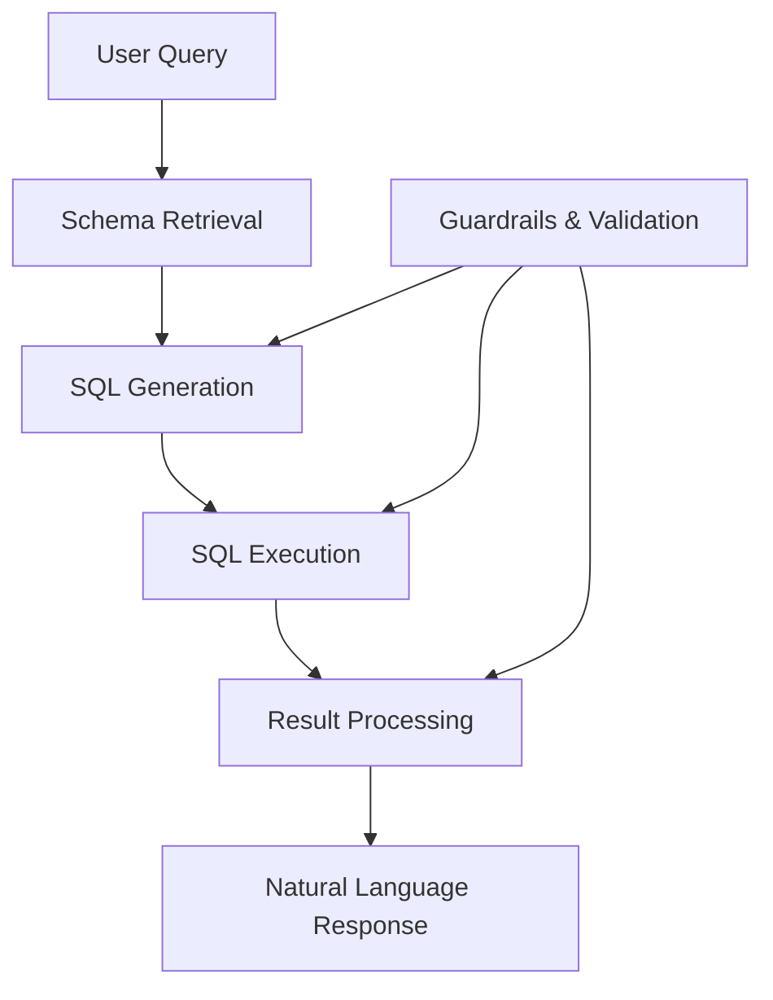
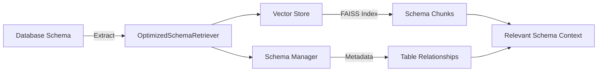
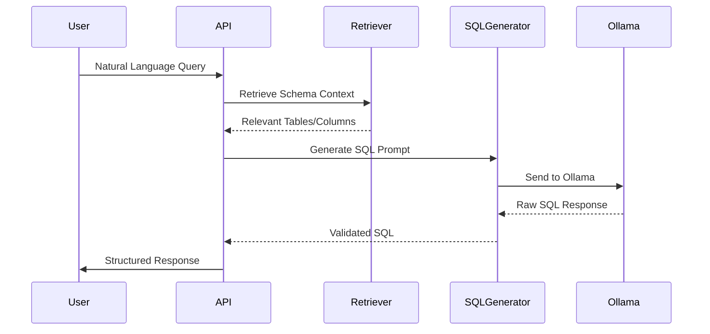
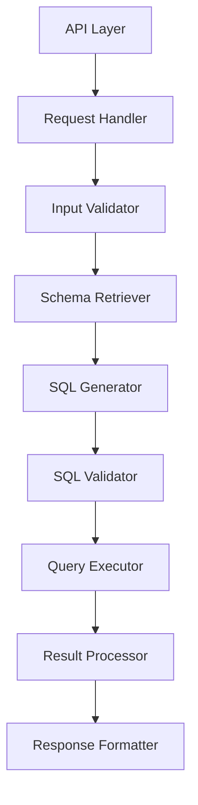

# Chat with SQL: RAG-Enhanced Database Interaction System

*Version: 2.1 | Last Updated: February 18, 2026*

## Executive Summary
This document details the architecture and implementation of a Retrieval-Augmented Generation (RAG) based system that enables natural language interaction with SQL databases. The system combines vector embeddings, hybrid search, and the Ollama LLM to provide accurate SQL query generation from natural language inputs. The implementation focuses on schema-aware retrieval, SQL generation, and result explanation without authentication layers.

## Table of Contents
- [1. High-Level System Design](#1-high-level-system-design)
  - [Architecture Overview](#architecture-overview)
  - [Schema Indexing & Retrieval](#schema-indexing--retrieval-layer)
  - [SQL Generation](#sql-generation-step)
  - [SQL Execution](#sql-execution-step)
  - [Result-to-Text Generation](#result-to-text-generation)
  - [Guardrails and Validation](#guardrails-and-validation)
- [2. Implementation Details](#2-implementation-details)
  - [Schema Retrieval (RAG)](#a-schema-retrieval-rag)
  - [SQL Generation Prompt](#b-sql-generation-prompt)
  - [SQL Execution Layer](#c-sql-execution-layer)
  - [Result → Natural Language](#d-result--natural-language-answer)
  - [Error Handling](#error-handling-and-edge-cases)

---

## 1. High-Level System Design

### Architecture Overview



### Schema Indexing & Retrieval Layer



| Component | Implementation Details | Key Features |
|-----------|------------------------|-------------|
| **OptimizedSchemaRetriever** | - Manages schema retrieval<br>- Handles lazy initialization<br>- Tracks table relationships | - On-demand loading<br>- Metadata filtering<br>- Incremental updates |
| **Vector Store** | - FAISS-based storage<br>- Handles schema embeddings<br>- Manages table chunks | - Efficient similarity search<br>- Memory optimization<br>- Batch processing |
| **Schema Manager** | - Maintains schema state<br>- Tracks table relationships<br>- Manages metadata | - Schema versioning<br>- Dependency tracking<br>- Caching |
| **Embedding System** | - Generates vector representations<br>- Handles text chunks<br>- Manages dimensions | - Batch processing<br>- Dimension reduction<br>- Normalization |

### SQL Generation Process



#### Key Components
1. **SQLGenerator**
   - Manages Ollama API communication
   - Handles prompt construction
   - Validates SQL output
   - Implements retry logic

2. **Prompt Engineering**
   - Schema context injection
   - Few-shot examples
   - Format constraints
   - Safety validations

2. **Prompt Engineering**
   - Schema-aware prompt construction
   - Constraint enforcement
   - Output formatting instructions

### SQL Execution & Validation

#### Architecture
```python
class SQLValidator:
    def __init__(self):
        self.allowed_keywords = {'SELECT', 'FROM', 'WHERE', 'JOIN', 'GROUP BY'}
        self.restricted_keywords = {'DROP', 'DELETE', 'UPDATE', 'INSERT'}
    
    def validate_sql(self, query: str) -> bool:
        """Validate SQL query for safety and correctness"""
        # Check for restricted keywords
        query_upper = query.upper()
        if any(keyword in query_upper for keyword in self.restricted_keywords):
            return False
            
        # Basic syntax validation
        if not query_upper.strip().startswith('SELECT'):
            return False
            
        return True
```

#### Execution Flow
1. **Query Validation**
   - Syntax checking
   - Restricted operations
   - Schema compliance
   
2. **Safe Execution**
   - Parameterized queries
   - Timeout handling
   - Result size limits
   - Error handling

- **Query Processing**
  ```python
  async def execute_query(sql: str):
      with timeout(30):
          return await connection.execute(sql)
  ```

### Result-to-Text Generation

| Case | Handling |
|------|----------|
| **Empty Results** | Informative "no results" message |
| **Single Row** | Direct mapping to natural language |
| **Multiple Rows** | Statistical summary + sample |
| **Large Results** | Aggregated view with key insights |

## Safety & Validation Framework

### 1. Input Validation
```python
def validate_user_input(query: str) -> bool:
    """Validate user input to prevent injection and abuse"""
    # Basic length check
    if not query or len(query.strip()) < 2:
        return False
        
    # Check for potential SQL injection patterns
    injection_indicators = [
        r';\s*--',  # SQL comments
        r'\b(?:DROP|ALTER|TRUNCATE|DELETE|UPDATE|INSERT|CREATE|GRANT)\b',
        r'\b(?:UNION\s+SELECT|EXEC\s*\(|EXECUTE\s*\()',
        r'\b(?:xp_cmdshell|sp_configure|xp_regread)\b',
        r'\b(?:WAITFOR\s+DELAY|SLEEP\s*\()',
        r'\b(?:LOAD_FILE\s*\(|INTO\s+(?:OUT|DUMP)FILE\b)',
        r'\b(?:SHUTDOWN|SHUTDOWN\s+WITH\s+NOWAIT)\b',
        r'\b(?:DECLARE|EXEC\s+@|EXECUTE\s+@)\b',
        r'\b(?:OPENQUERY|OPENROWSET|OPENDATASOURCE)\b',
        r'\b(?:sp_adduser|sp_dropuser|sp_addrole|sp_droprole)\b',
        r'\b(?:BEGIN\s+TRANSACTION|COMMIT|ROLLBACK|SAVEPOINT)\b',
        r'\b(?:KILL\s+\d+|SHUTDOWN\s+WITH\s+NOWAIT)\b',
        r'\b(?:ALTER\s+DATABASE|BACKUP\s+DATABASE|RESTORE\s+DATABASE)\b',
        r'\b(?:CREATE\s+(?:PROC|PROCEDURE|FUNCTION|TRIGGER|VIEW))\b',
        r'\b(?:GRANT|DENY|REVOKE)\b',
        r'\b(?:TRUNCATE\s+TABLE|DROP\s+TABLE|DELETE\s+FROM)\b',
        r'\b(?:INSERT\s+INTO|UPDATE\s+\w+\s+SET|MERGE\s+INTO)\b',
        r'\b(?:DECLARE\s+@|SET\s+@|SELECT\s+@)\b',
        r'\b(?:CAST\s*\(|CONVERT\s*\()',
        r'\b(?:CHARINDEX|SUBSTRING|PATINDEX|REPLACE)\s*\('
    ]
    
    query_upper = query.upper()
    return not any(re.search(pattern, query_upper, re.IGNORECASE) 
                  for pattern in injection_indicators)
```

### 2. SQL Validation
- **Syntax Checking**: Ensure valid SQL syntax
- **Read-Only**: Only allow SELECT queries
- **Schema Validation**: Verify tables/columns exist
- **Cost Estimation**: Prevent expensive queries
- **Size Limits**: Restrict result set size

### 3. Output Sanitization
- Remove sensitive data
- Limit result size
- Format consistently
- Add metadata

- **Input Validation**
  ```python
  def validate_input(query: str) -> bool:
      return not any(bad in query.lower() for bad in ['drop', 'delete', ';--'])
  ```

- **Output Validation**
  - SQL syntax verification
  - Schema compliance
  - Result size limits

---

## 2. Implementation Guide

### Development Setup
```bash
# Clone repository
git clone https://github.com/your-repo/chat-with-sql.git
cd chat-with-sql

# Install dependencies
pip install -r requirements.txt

# Environment setup
cp .env.example .env
# Edit .env with your configuration

# Initialize database
python scripts/init_db.py
```

### Configuration
```yaml
# config/config.yaml
database:
  host: localhost
  port: 5432
  name: mydb
  user: user

llm:
  model: gpt-4
  temperature: 0.3
  max_tokens: 1000

retrieval:
  top_k: 5
  similarity_threshold: 0.7
  cache_ttl: 3600

security:
  read_only: true
  max_query_time: 30
  max_result_rows: 1000
```

### a) Schema Retrieval (RAG)

```python
class HybridRetriever:
    def __init__(self, vector_store, bm25_index):
        self.vector_store = vector_store
        self.bm25_index = bm25_index
    
    def retrieve(self, query: str, top_k: int = 5) -> List[Dict]:
        # Hybrid search implementation
        vector_results = self.vector_store.search(query, k=top_k*2)
        bm25_results = self.bm25_index.search(query, k=top_k*2)
        return self._rerank_and_merge(vector_results, bm25_results)[:top_k]
```

### b) SQL Generation Prompt

```python
def build_sql_prompt(query: str, schema: Dict) -> str:
    return f"""# Database Schema
{format_schema(schema)}

# Instructions
1. Generate a valid SQL SELECT query
2. Use ONLY these tables: {', '.join(schema['tables'])}
3. Never include non-existent columns
4. Add LIMIT 100 if not specified
5. Format: ```sql
   [your query here]
   ```

# Question: {query}"""
```

### c) SQL Execution Layer

```python
class SQLExecutor:
    def __init__(self, pool):
        self.pool = pool
    
    async def execute(self, sql: str) -> Dict:
        try:
            async with self.pool.acquire() as conn:
                result = await conn.execute(sql)
                return {
                    'status': 'success',
                    'data': await result.fetchall(),
                    'rowcount': result.rowcount
                }
        except Exception as e:
            return {'status': 'error', 'error': str(e)}
```

### d) Result → Natural Language Answer

```python
def generate_response(query: str, results: Dict) -> str:
    if not results.get('data'):
        return "No results found for your query."
        
    template = """Given the query "{query}" and the following results:
    
    {results}
    
    Provide a concise 1-2 sentence summary of the findings.
    """
    return llm_complete(template)
```

### Error Handling and Edge Cases

```python
def handle_query(query: str) -> Dict:
    try:
        # 1. Input validation
        if not query.strip():
            raise ValueError("Empty query")
            
        # 2. Process through pipeline
        schema = retriever.retrieve(query)
        sql = sql_generator.generate(query, schema)
        results = executor.execute(sql)
        
        # 3. Generate response
        return {
            'status': 'success',
            'sql': sql,
            'response': response_generator.generate(query, results)
        }
        
    except Exception as e:
        return {
            'status': 'error',
            'error': str(e),
            'suggestion': 'Please try rephrasing your query.'
        }
```

---

## Performance Optimization

### 1. Caching Strategy
```python
class HybridCache:
    def __init__(self, max_size=1000, ttl=3600):
        self.semantic_cache = LRUCache(max_size)
        self.exact_cache = {}
        self.ttl = ttl
    
    def get(self, query: str, embedding: List[float]):
        # 1. Check exact match
        if query in self.exact_cache:
            return self.exact_cache[query]
        
        # 2. Check semantic similarity
        for key in self.semantic_cache:
            if cosine_similarity(embedding, key) > 0.9:
                return self.semantic_cache[key]
        
        return None
```

### 2. Query Optimization
- Query plan analysis
- Index recommendations
- Result set streaming

### 3. Monitoring
```python
@dataclass
class PerformanceMetrics:
    query_count: int = 0
    avg_latency: float = 0.0
    error_rate: float = 0.0
    cache_hit_rate: float = 0.0
    
    def update(self, query_time: float, cache_hit: bool):
        self.query_count += 1
        self.avg_latency = (
            (self.avg_latency * (self.query_count - 1) + query_time) 
            / self.query_count
        )
        if cache_hit:
            self.cache_hit_rate = (
                (self.cache_hit_rate * (self.query_count - 1) + 1) 
                / self.query_count
            )
```

1. **Caching**
   - Query result caching
   - Schema access patterns
   - LLM response caching

2. **Optimizations**
   - Batch processing of queries
   - Lazy loading of schema
   - Connection pooling

3. **Monitoring**
   - Query execution times
   - Error rates
   - Cache hit ratios

## System Architecture

### 1. Core Components


### 2. Data Flow
1. **Request Handling**
   - Validate input
   - Parse parameters
   - Initialize context
   
2. **Schema Retrieval**
   - Get relevant tables
   - Fetch column details
   - Build schema context
   
3. **SQL Generation**
   - Construct prompt
   - Call LLM
   - Parse response
   
4. **Execution & Response**
   - Validate SQL
   - Execute query
   - Format results
   
### 3. Performance Considerations
- **Caching**: Query results, schema info
- **Batching**: Parallel operations
- **Lazy Loading**: On-demand resources
- **Connection Pooling**: Database connections

## Deployment & Operations

### 1. System Requirements
- **Minimum**:
  - 2 vCPUs
  - 8GB RAM
  - 50GB storage
  - Python 3.8+
  - Ollama server
  - Database access

### 2. Installation
```bash
# Clone repository
git clone https://github.com/your-org/chat-with-sql.git
cd chat-with-sql

# Install dependencies
pip install -r requirements.txt

# Configure environment
cp .env.example .env
# Edit .env with your settings

# Initialize database (if needed)
python src/chat_sql/setup_database.py
```

### 3. Running the Service
```bash
# Start API server
uvicorn src.chat_sql.api.v3_api:app --host 0.0.0.0 --port 8001 --reload

# In another terminal, start the UI
streamlit run chat_ui.py --server.port 8503
```

## Monitoring & Maintenance

### Logging Configuration
```python
import logging

logging.basicConfig(
    level=logging.INFO,
    format='%(asctime)s - %(name)s - %(levelname)s - %(message)s',
    handlers=[
        logging.FileHandler('chat_sql.log'),
        logging.StreamHandler()
    ]
)
```

### Performance Metrics
- Query response times
- Error rates
- Cache hit ratios
- Resource utilization

### Common Issues & Solutions

1. **Ollama Connection Issues**
   ```bash
   # Check if Ollama is running
   curl http://localhost:11434/api/tags
   
   # Start Ollama if needed
   ollama serve
   ```

2. **Database Connection Problems**
   - Verify connection string in `.env`
   - Check database permissions
   - Ensure network connectivity

3. **Performance Optimization**
   - Enable query caching
   - Optimize database indexes
   - Monitor resource usage

---

## Future Enhancements

1. **Advanced Features**
   - Query explanation
   - Visual query builder
   - Automated schema documentation
   - Multi-database support

2. **Performance**
   - Query plan analysis
   - Index recommendations
   - Result caching
   - Connection pooling

3. **Security**
   - Role-based access control
   - Query whitelisting
   - Audit logging
   - Rate limiting

---

*Documentation Version: 2.1 | Last Updated: February 18, 2026*
